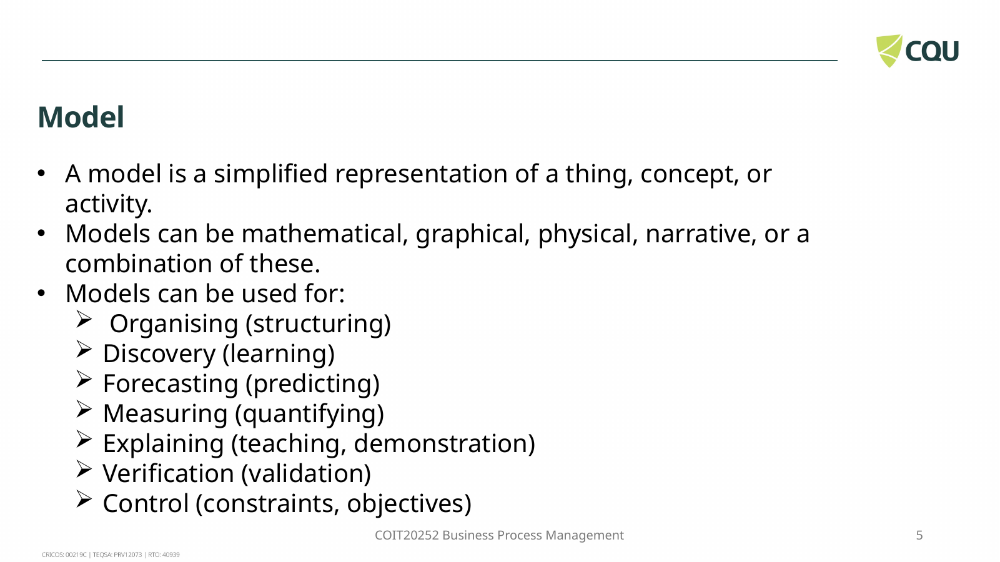
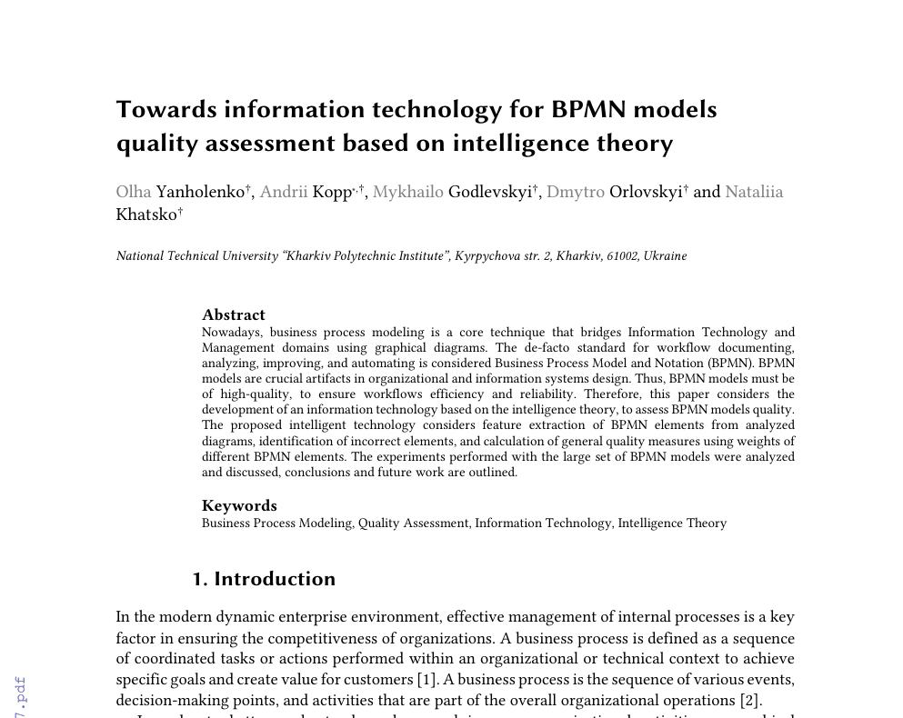
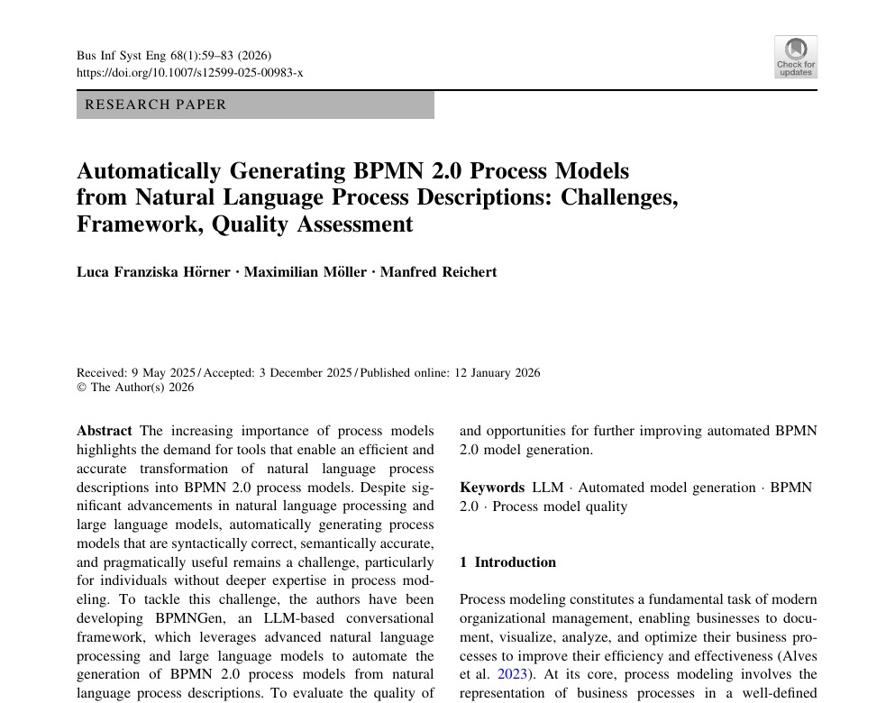
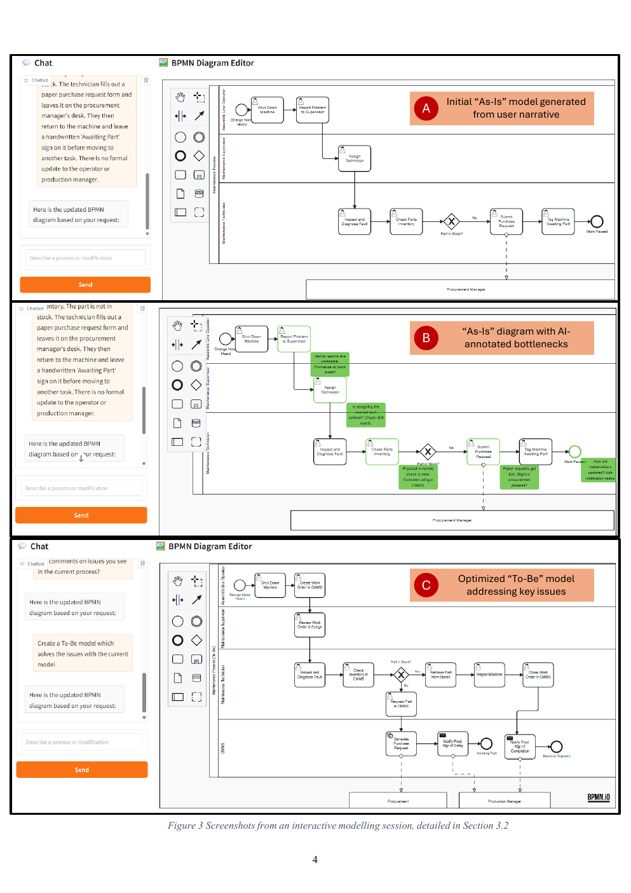

# E-portfolio 2: Business Process Modelling
| [Business Process Modelling](business-process-modelling.md) | 

## Artefact 1: Purpose and choice of process models

**Artefact type:** Lecture screenshot  
**Source:** CQUniversity Moodle

*Figure 5. Definition and uses of a process model from the Week 4 lecture (Morshed 2026, slide 5).*

The Week 4 lecture introduces a process model as a simplified model constructed for a specific purpose. Models can be used for discovery, explanation, measurement and control. It also makes comparisons with BPMN, swimlanes, flowcharts, value stream maps and SIPOC (Morshed 2026, slides 5-7, 22-29).

This slide got me thinking that I had been assuming that a detailed diagram was always best. Detail may be beneficial for technical users but it can obscure the big picture for managers. This has to do with the purpose and audience of the model, not the number of symbols. SIPOC can be sufficient for initial scope agreement, while BPMN suits decisions and interactions (Morshed 2026, slides 20, 27-29). Before choosing the notation and depth of a model, I would ask who will use the model.

## Artefact 2: Automated BPMN quality assessment

**Artefact type:** Peer-reviewed conference paper  
**Source:** [Towards information technology for BPMN models quality assessment based on intelligence theory](https://ceur-ws.org/Vol-4004/paper7.pdf)

*Figure 6. Source excerpt from the BPMN quality assessment paper (Yanholenko et al. 2025, p. 49).*

Yanholenko et al. suggest a tool that reads BPMN XML, checks element rules and determines a weighted quality score. A test was performed with real models, and 3,722 models were processed out of 3,729. The tool identified missing events, irregular flows and improperly used gateways in the goods-dispatch model (Yanholenko et al. 2025, pp. 53-58).

Interestingly, the example model still scored 0.79 even though it had several structural errors (Yanholenko et al. 2025, p. 58). Even a syntactically correct model may misrepresent the work or be difficult for its audience to understand. I would perform automated checks first, then validate the activities, roles and exceptions with stakeholders.

## Artefact 3: LLM-generated BPMN models

**Artefact type:** Peer-reviewed journal study  
**Source:** [Automatically generating BPMN 2.0 process models from natural language process descriptions](https://doi.org/10.1007/s12599-025-00983-x)

*Figure 7. Source excerpt from the BPMNGen evaluation study (Hörner, Möller & Reichert 2026, p. 59).*

Hörner, Möller and Reichert review BPMNGen, an approach that generates BPMN 2.0 models from natural-language descriptions. They explore semantic correctness and user understanding. Simple and moderately challenging processes yielded positive outcomes, whereas more difficult processes experienced a decrease in performance (Hörner, Möller & Reichert 2026, pp. 59-60).

A model may appear convincing while lacking data, roles or message exchanges. The authors also note that their evaluation used simple scenarios, non-expert participants and some self-reported measures (Hörner, Möller & Reichert 2026, p. 60). I would consider its output as a draft and review gateways, participants and meaning against the original process evidence. This check is more important if the process is less predictable.

## Artefact 4: An AI-supported AS-IS and TO-BE case

**Artefact type:** Applied conference case  
**Source:** [Documenting SME processes with conversational AI: from tacit knowledge to BPMN](https://doi.org/10.1049/icp.2025.3640)

*Figure 8. AI-generated BPMN model and annotated improvement stages (Radhakrishnan 2025, p. 4).*

Radhakrishnan applies a conversational assistant to an equipment-maintenance process. It converts an informal account into an AS-IS BPMN model, highlights bottlenecks and creates a TO-BE model. The three phases lasted over 12 minutes and revealed gaps caused by manual reporting and paper-based requests (Radhakrishnan 2025, pp. 4-5).

This case is not about drawing alone but about modelling and improvement. Handoffs and missing updates are clear in the AS-IS view. The TO-BE view provides a proposal that people can discuss. However, the author reports that experts did not formally validate the redesigned model and repeated runs might differ (Radhakrishnan 2025, p. 5). I now consider a TO-BE diagram as a hypothesis. I would check feasibility, risks and customer value with the staff performing the process before implementation.

## Reference list

Hörner, LF, Möller, M & Reichert, M 2026, 'Automatically generating BPMN 2.0 process models from natural language process descriptions: challenges, framework, quality assessment', *Business & Information Systems Engineering*, vol. 68, no. 1, pp. 59-83, viewed 8 August 2026, <https://doi.org/10.1007/s12599-025-00983-x>.

Morshed, A 2026, *COIT20252 Business Process Management Week 4: Process Modelling*, PowerPoint slides, CQUniversity, Moodle.

Radhakrishnan, U 2025, 'Documenting SME processes with conversational AI: from tacit knowledge to BPMN', *IET Conference Proceedings*, vol. 2025, no. 28, viewed 8 August 2026, <https://doi.org/10.1049/icp.2025.3640>.

Yanholenko, O, Kopp, A, Godlevskyi, M, Orlovskyi, D & Khatsko, N 2025, 'Towards information technology for BPMN models quality assessment based on intelligence theory', *Proceedings of the 7th International Workshop on Modern Machine Learning Technologies*, CEUR Workshop Proceedings, vol. 4004, viewed 8 August 2026, <https://ceur-ws.org/Vol-4004/paper7.pdf>.

