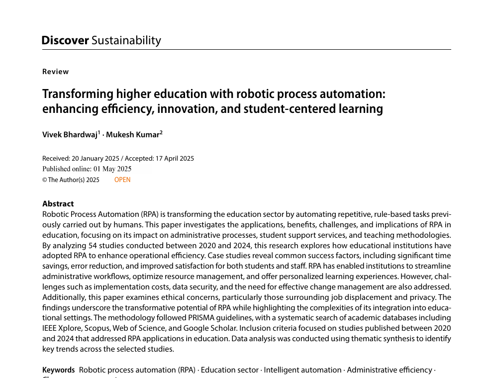
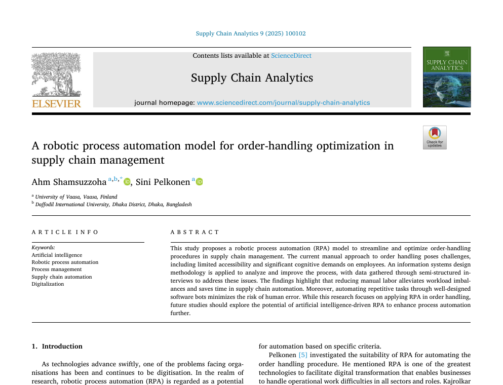
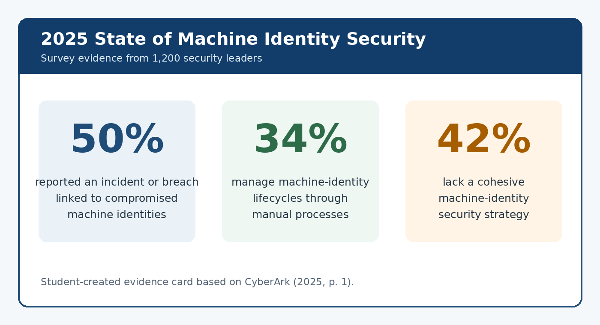
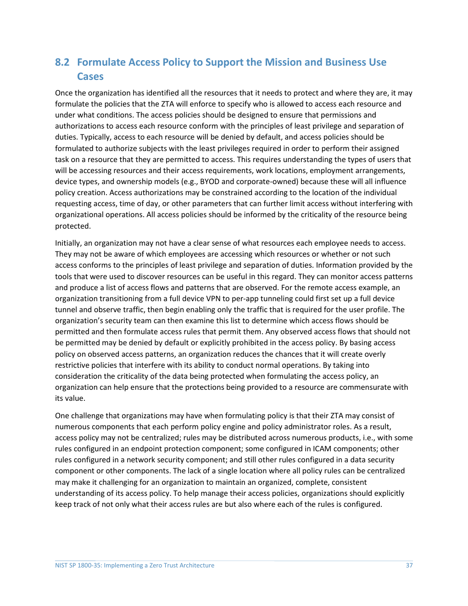

# E-portfolio 3: Robotic Process Automation and Process Cybersecurity

 [RPA and Process Cybersecurity]

## Artefact 1: RPA suitability and architecture

**Artefact type:** Peer-reviewed review article  
**Source:** [Transforming higher education with robotic process automation](https://doi.org/10.1007/s43621-025-01198-6)

*Figure 9. Source excerpt from the RPA review article (Bhardwaj & Kumar 2025, p. 1).*

According to Bhardwaj and Kumar, RPA uses software bots that execute rules and mimic human actions on digital systems. Their architecture includes design, execution, orchestration and security layers. RPA is suitable for repetitive and structured tasks, but user-interface automation might be hindered by interface changes (Bhardwaj & Kumar 2025, pp. 2-3).

This article helped me to correct my previous thinking that RPA and AI are similar. While RPA performs a set of predetermined steps, AI can take automation beyond the structured aspects of work (Bhardwaj & Kumar 2025, p. 2). A process with relatively few exceptions and little judgement is more likely to be a good fit for a bot, while a process that requires many exceptions and judgements is not a good fit. I would examine rules, data quality, system stability and exception rates before recommending automation.

## Artefact 2: RPA for order handling

**Artefact type:** Applied journal case study  
**Source:** [A robotic process automation model for order-handling optimization in supply chain management](https://doi.org/10.1016/j.sca.2025.100102)

*Figure 10. Source excerpt from the order-handling automation case (Shamsuzzoha & Pelkonen 2025, p. 1).*

Shamsuzzoha and Pelkonen investigate order handling in a motor factory in Finland, where 90 per cent of order lines were processed manually. They use interviews and create process charts to determine automation targets. Examples of suitable tasks are those that are digital, repetitive and have few exceptions (Shamsuzzoha & Pelkonen 2025, pp. 2-3).

The same study cautions that weak rules, poor data and changing interfaces can create incomplete work and maintenance costs (Shamsuzzoha & Pelkonen 2025, pp. 3-4). In practice I would try to improve and standardise the process first. I would also retain a human path for unusual orders that cannot be handled safely by automation.

## Artefact 3: Machine-identity risk in automated processes

**Artefact type:** Current industry research infographic  
**Source:** [2025 State of Machine Identity Security Report infographic](https://mms.businesswire.com/media/20250313883089/en/2408458/1/CyberArk_2025_State_of_Machine_Identity_Security_Report_Infographic_FINAL.pdf?download=1)

*Figure 11. Evidence card prepared from the 2025 machine-identity security infographic (CyberArk 2025, p. 1).*

According to CyberArk, half of respondents (50 per cent) experienced an incident or breach associated with compromised machine identities. It also reports that 34 per cent manage identity lifecycles manually and 42 per cent do not have a coherent strategy (CyberArk 2025, p. 1).

A software bot is also an identity because it logs in, reads data and performs actions. This makes excessive access more dangerous than a normal process delay. However, the infographic comes from vendor research and does not provide enough detail about its methodology, so the percentages require caution. I would give each of the bots its own credentials and accountable owner. Only the necessary systems and functions should be made accessible to the bot.

## Artefact 4: Zero-trust controls for automated work

**Artefact type:** NIST cybersecurity practice guide  
**Source:** [Implementing a Zero Trust Architecture](https://doi.org/10.6028/NIST.SP.1800-35)

*Figure 12. NIST access-policy guidance on least privilege and separation of duties (Borchert et al. 2025, p. 37).*

NIST's 2025 guide states that it is important to inventory resources, plan access around 'least privilege' and separation of duties, and monitor behaviour continuously. It also requires logging, security validation and testing of authorised and unauthorised service-to-service requests (Borchert et al. 2025, pp. 37-41).

A credential vault alone cannot control a bot that has unnecessary permissions or an unreviewed workflow. Security needs to encompass the entire lifecycle from bot creation through change, monitoring and retirement. I would add the principles of least privilege, change approvals, secure credentials, logs, exception handling and human oversight. These controls should also be reviewed whenever the bot, connected system or business rule changes. Automation should make processes faster without removing accountability.

## Reference list

Bhardwaj, V & Kumar, M 2025, 'Transforming higher education with robotic process automation: enhancing efficiency, innovation, and student-centered learning', *Discover Sustainability*, vol. 6, article 356, viewed 8 August 2026, <https://doi.org/10.1007/s43621-025-01198-6>.

Borchert, O, Howell, G, Kerman, A, Rose, S & Souppaya, M 2025, *Implementing a zero trust architecture*, NIST Special Publication 1800-35, National Institute of Standards and Technology, Gaithersburg, viewed 8 August 2026, <https://doi.org/10.6028/NIST.SP.1800-35>.

CyberArk 2025, *2025 State of Machine Identity Security Report: infographic*, CyberArk, viewed 8 August 2026, <https://mms.businesswire.com/media/20250313883089/en/2408458/1/CyberArk_2025_State_of_Machine_Identity_Security_Report_Infographic_FINAL.pdf?download=1>.

Shamsuzzoha, A & Pelkonen, S 2025, 'A robotic process automation model for order-handling optimization in supply chain management', *Supply Chain Analytics*, vol. 9, article 100102, viewed 8 August 2026, <https://doi.org/10.1016/j.sca.2025.100102>.

